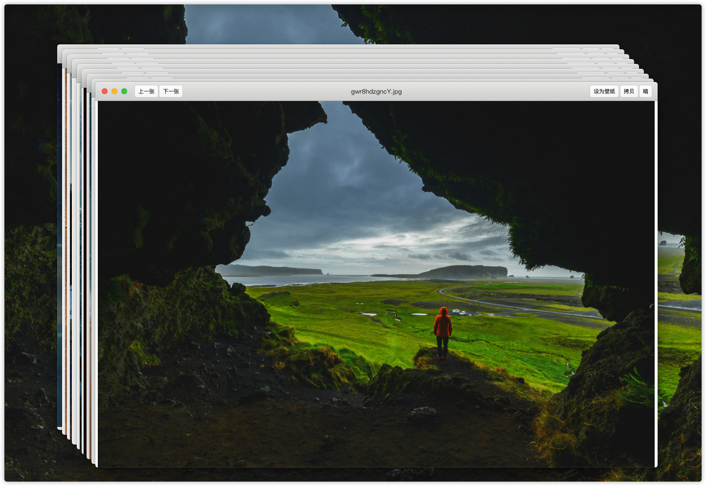
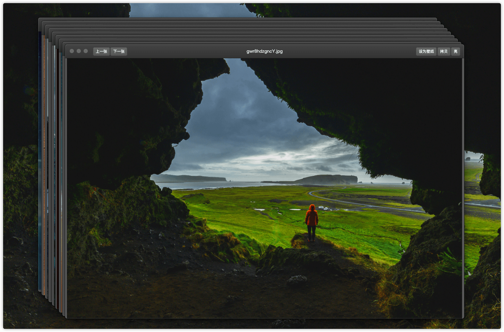

# Kan Kan

[中文](readme.md) 

As yout can see, the image preview software of Mac OS has a terrible experience:  it can't be zoomed in with the scroll wheel, and it doesn't support viewing all the pictures in the folder directly...   
So, I developed this software.   
Kankan is a Mac OS software to help you quickly look pictures. The experience is similar to win10's "image" and "king of pictures" apps.  

## SCREENSHOT  
Day Mode  

Dark Mode  

## WHAT WE HAVE  
1.Fully comply with the Mac OS native design language, and the UI is simple and generous  
2."Dark mode" is supported natively, which can be switched automatically or manually between "light" and "dark" themes  
3.Enlarge image by wheeling support   
4.Drag image support  
5.Support browsing all images under the folder  
6.Support previous, next and cycle browsing  
7.Support setting wallpaper  
8.Support to copy file name and path  
9.Support for copying images  

More content will be added according to user feedback in the future...  

## UPDATE  
version  |time           |content                                                      |download
------------|----------------|------------------------------------------------------|----
0.2.0      |2020.04.03|first version，A small amount bugs    |-
0.2.3      |2020.04.03|Fix bugs, basically complete functions |-
0.2.4|2020.04.16|New functions:   1. Add the magnification display.  2. Add the resolution display.  3. Add new original size function.  4. Modify some menus and button positions|[0.2.4.dmg.zip](https://github.com/newham/kankan/releases/download/v0.2.4/kankan-0.2.4.dmg.zip)

## THANKS TO  
[Electron](https://www.electronjs.org)，This software is developed based on this project

## COPYRIGHT  
Liu Han

## FEEDBACK   
[newham.cn@gmail.com](mailto:newham.cn@gmail.com)  

