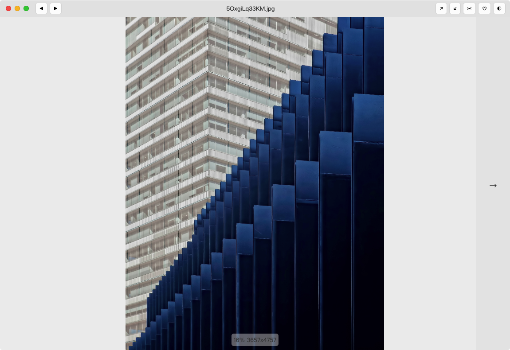
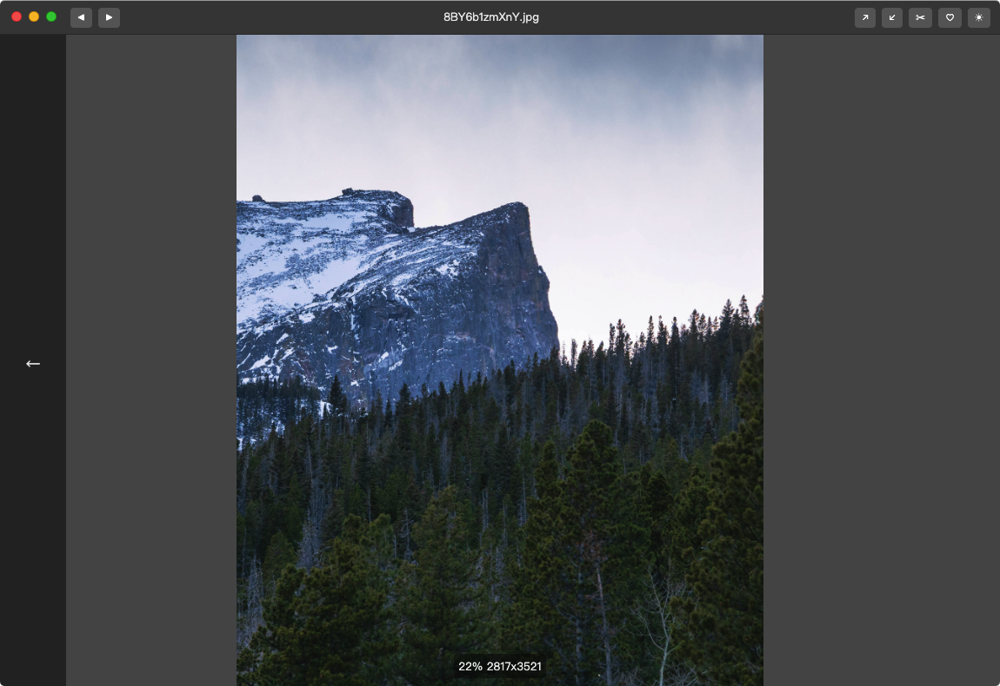

# Kan Kan

[中文](readme.zh.md) 

As yout can see, the image preview software of Mac OS has a terrible experience:  it can't be zoomed in with the scroll wheel, and it doesn't support viewing all the pictures in the folder directly...   
So, I developed this software.   
Kankan is a Mac OS software to help you quickly look pictures. The experience is similar to win10's "image" and "king of pictures" apps.  

## SCREENSHOT  
Day Mode  

Dark Mode  

## WHAT WE HAVE  
1.Fully comply with the Mac OS native design language, and the UI is simple and generous  
2."Dark mode" is supported natively, which can be switched automatically or manually between "light" and "dark" themes  
3.Enlarge image by wheeling support   
4.Drag image support  
5.Support browsing all images under the folder  
6.Support previous, next and cycle browsing  
7.Support setting wallpaper  
8.Support to copy file name and path  
9.Support for copying images  

More content will be added according to user feedback in the future...  

## SUPPORTED IMAGE FORMATS
Suffix|Support
---|---
.jpg|✅
.jpeg|✅
.png|✅
.bmp|✅
.gif|✅
.ico|✅

## SHORTCUTS
Key|Function
---|---
↓,→|Next
↑,←|Previous
Esc|Exit app
Double-click|Original size ↔ Fit to window

## BUTTON FUNCTIONS
Button|Function
---|---
◀|previous
▶|next
↗|Maximize to window size
↙|Minimize to original size
✂|Copy to clipboard
♡|Set as wallpaper (Authorization is required to operate 'Finder')
↺|Rotate picture counter-clockwise
↻|Rotate picture clockwise
◐|Change to the dark theme

## UPDATE  
version  |time           |content                                                      |download
------------|----------------|------------------------------------------------------|----
0.2.0      |2020.04.03|first version，A small amount bugs    |-
0.2.3      |2020.04.03|Fix bugs, basically complete functions |-
0.2.4|2020.04.16|New features:   1. Add the magnification display.  2. Add the resolution display.  3. Add new original size function.  4. Modify some menus and button positions|-
0.2.5|2020.05.31|New features:  1.Globalization support，3 languages supported: **zh-CN** **en** **en-US**  More work needs yours help and feedback. **If you need support from other languages, please give me [feedback](mailto:newham.cn@gmail.com) !** 2.Fix the bug that you can still right-click to open the menu in Hello page.|-
0.3.1|2020.08.09|New features:  1. Add drag and drop support, drag the picture to the window to open it! 2. Fix the problem of scrollbar in Y-axis when browsing large images in version <= mac os 10.14.  3. Fix the bug that the welcome window cannot be moved.|-
***0.4.0**|2021.07.02|New feature: clockwise / counter-clockwise rotation of pictures supported|[0.4.0.dmg.zip](https://github.com/newham/kankan/releases/download/v0.4.0/kankan-0.4.0.dmg.zip)

## THANKS TO  
[Electron](https://www.electronjs.org)，This software is developed based on this project

## COPYRIGHT  
Liu Han

## FEEDBACK   
[newham.cn@gmail.com](mailto:newham.cn@gmail.com)  

## BUY ME A COFFEE

